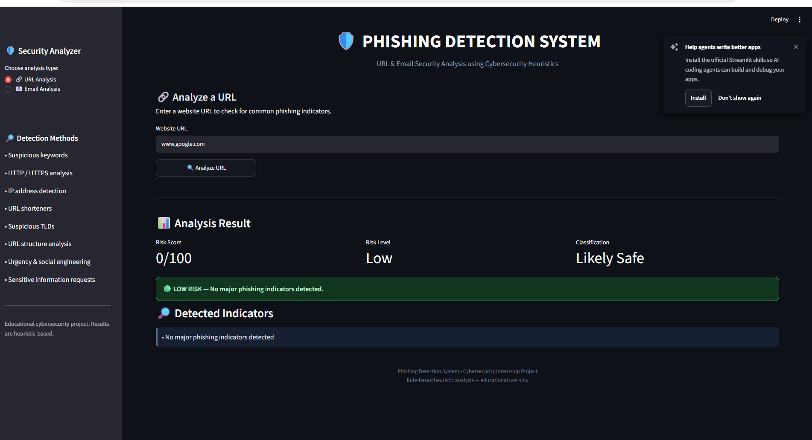
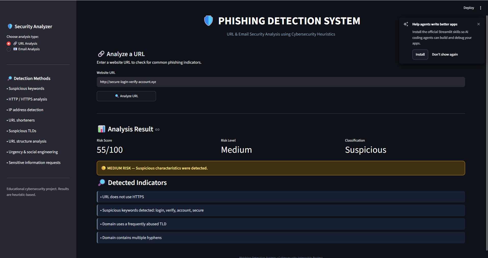
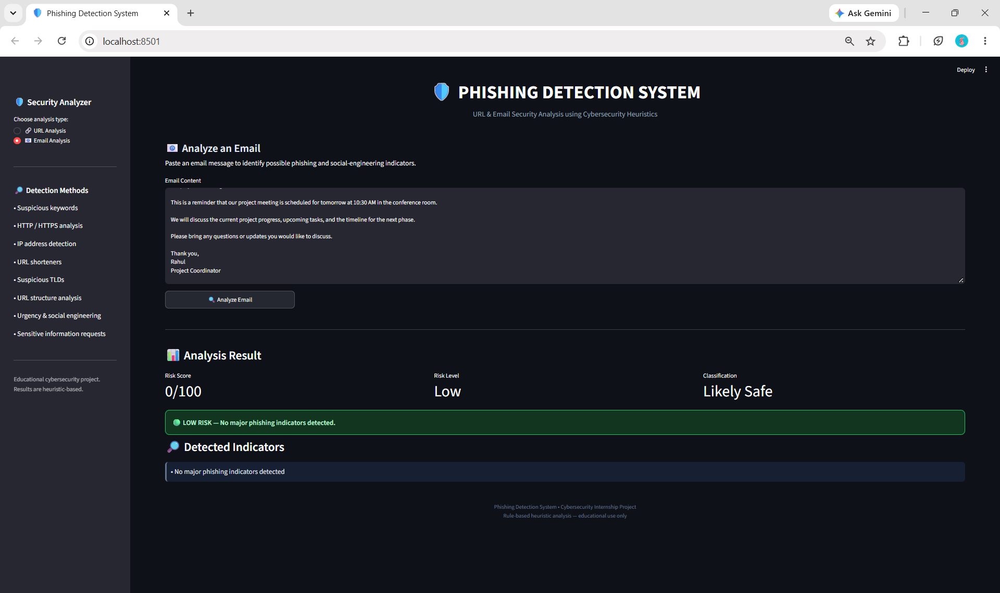

# 🛡️ Phishing Detection System

A cybersecurity application that analyzes **URLs and email messages** to identify common phishing indicators using rule-based security heuristics.

The system provides a risk score from **0–100** and classifies the input as Low, Medium, or High risk.

---

## 📌 Project Overview

Phishing is a common form of cyber attack in which attackers use fake websites, malicious links, and social-engineering techniques to steal sensitive information such as passwords, banking details, and account credentials.

This project analyzes user-provided URLs and email content for characteristics commonly associated with phishing attacks.

The system is designed as an educational cybersecurity project to demonstrate basic phishing detection techniques.

---

## 🚀 Features

### 🔗 URL Analysis

The URL analyzer checks for:

- HTTP instead of HTTPS
- IP addresses used instead of domain names
- `@` symbols that may hide the actual domain
- Unusually long URLs
- Suspicious keywords
- URL shortening services
- Frequently abused TLDs
- Excessive subdomains
- Multiple hyphens in domains
- Suspicious `..` path patterns
- Potentially executable file extensions
- Punycode domains
- Excessive domain sections

---

### 📧 Email Analysis

The email analyzer checks for:

- Suspicious keywords
- Urgency and pressure tactics
- Account suspension messages
- Password and login requests
- Banking and payment requests
- OTP requests
- Verification and recovery requests
- Suspicious links
- Non-HTTPS links
- IP-based links
- Unusually long links

---

## 📊 Risk Classification

| Score | Risk Level | Classification |
|------:|------------|----------------|
| 0–29 | Low | Likely Safe |
| 30–59 | Medium | Suspicious |
| 60–100 | High | Suspicious |

The score is based on the number and severity of detected indicators.

---

## 🖥️ Application Interface

The project provides a Streamlit web interface with two analysis modes:

### URL Analysis

Users can enter a URL and receive:

- Risk score
- Risk level
- Classification
- Detected phishing indicators

### Email Analysis

Users can paste an email message and receive:

- Risk score
- Risk level
- Classification
- Detected phishing indicators

---

## 🛠️ Technologies Used

- Python
- Streamlit
- Regular Expressions
- URL Parsing
- Rule-Based Detection
- Cybersecurity Heuristics

---

## 📂 Project Structure

```text
Phising_Detection_System/
│
├── app.py
├── main.py
├── url_analyzer.py
├── email_analyzer.py
├── requirements.txt
├── README.md
├── .gitignore
└── venv/


## 📸 Application Screenshots

### 🔗 Safe URL Analysis


### 🚨 Suspicious URL Detection


### 📧 Safe Email Analysis


### 🚨 Phishing Email Detection

