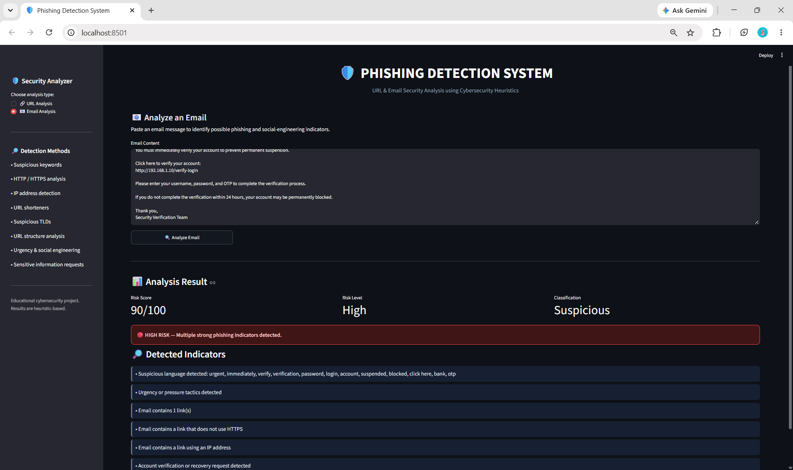

# 🛡️ Phishing Detection System

A Python-based cybersecurity application that analyzes **URLs and email messages** to identify common phishing indicators using rule-based security heuristics.

The system assigns a **risk score from 0–100** and classifies the input as **Likely Safe** or **Suspicious**, along with the detected security indicators.

> **Internship Project — Task 1: Phishing Detection System (URL & Email Analysis)**

---

## 📌 Overview

Phishing is a social-engineering attack in which attackers attempt to trick users into revealing sensitive information such as passwords, banking credentials, OTPs, or other personal information.

This project demonstrates a basic phishing detection approach by analyzing user-provided URLs and email messages for characteristics commonly associated with phishing attacks.

The application provides a **Streamlit-based web interface** where users can select URL or Email analysis and receive an immediate risk assessment.

---

## 🚀 Features

### 🔗 URL Analysis

The URL analyzer checks for multiple suspicious characteristics, including:

* HTTP instead of HTTPS
* IP addresses used instead of domain names
* `@` symbols that may obscure the actual domain
* Unusually long URLs
* Suspicious phishing-related keywords
* URL shortening services
* Frequently abused top-level domains (TLDs)
* Excessive subdomains
* Multiple hyphens in domain names
* Suspicious `..` path patterns
* Potentially executable file extensions
* Punycode / IDN domains
* Excessive dot-separated domain sections

### 📧 Email Analysis

The email analyzer checks email content for indicators such as:

* Suspicious keywords
* Urgency and pressure tactics
* Account suspension or blocking messages
* Password and login requests
* Banking and payment requests
* OTP requests
* Verification and recovery requests
* Suspicious URLs
* Non-HTTPS links
* IP-based URLs
* Unusually long URLs

---

## 📊 Risk Classification

| Risk Score | Risk Level | Classification |
| :--------: | :--------: | :------------: |
|    0–29    |     Low    |   Likely Safe  |
|    30–59   |   Medium   |   Suspicious   |
|   60–100   |    High    |   Suspicious   |

The risk score is calculated using weighted security indicators detected during analysis.

A higher score indicates that the input contains more characteristics commonly associated with phishing activity.

---

## 🖥️ Application

The application provides two analysis modes through a Streamlit web interface.

### URL Analysis

Users enter a URL and receive:

* Risk Score
* Risk Level
* Classification
* Detected phishing indicators

### Email Analysis

Users paste an email message and receive:

* Risk Score
* Risk Level
* Classification
* Detected phishing indicators

---

## 📸 Application Screenshots

### 🔗 Safe URL Analysis


### 🚨 Suspicious URL Detection


### 📧 Safe Email Analysis


### 🚨 Phishing Email Detection



---

## 🛠️ Technologies Used

* **Python**
* **Streamlit**
* **Regular Expressions (Regex)**
* **URL Parsing**
* **Rule-Based Detection**
* **Cybersecurity Heuristics**

---

## 📂 Project Structure

```text
Phishing-Detection-System/
│
├── app.py
├── main.py
├── url_analyzer.py
├── email_analyzer.py
├── requirements.txt
├── README.md
├── .gitignore
│
└── screenshots/
    ├── safe-url.png
    ├── suspicious-url.png
    ├── safe-email.png
    └── phishing-email.png
```

### File Description

| File                | Description                              |
| ------------------- | ---------------------------------------- |
| `app.py`            | Streamlit web interface                  |
| `main.py`           | Command-line interface                   |
| `url_analyzer.py`   | URL phishing analysis and risk scoring   |
| `email_analyzer.py` | Email phishing analysis and risk scoring |
| `requirements.txt`  | Python dependency list                   |
| `.gitignore`        | Files excluded from Git tracking         |
| `screenshots/`      | Application screenshots                  |

---

## ⚙️ Installation

### 1. Clone the Repository

```bash
git clone https://github.com/johnvalentina1413-stack/Phishing-Detection-System.git
```

### 2. Navigate to the Project Directory

```bash
cd Phishing-Detection-System
```

### 3. Create a Virtual Environment

```bash
python -m venv venv
```

### 4. Activate the Virtual Environment

**Windows PowerShell:**

```powershell
venv\Scripts\Activate.ps1
```

### 5. Install Dependencies

```bash
pip install -r requirements.txt
```

---

## ▶️ Running the Application

Start the Streamlit application using:

```bash
python -m streamlit run app.py
```

The application will open in your web browser.

---

## 💻 Command-Line Usage

The project also includes a command-line interface.

Run:

```bash
python main.py
```

The CLI allows users to perform URL and email analysis directly from the terminal.

---

## 🧪 Example Inputs

### Safe URL

```text
https://www.google.com
```

Expected result:

```text
Risk Score: 0
Risk Level: Low
Classification: Likely Safe
```

### Suspicious URL

```text
http://secure-login-verify-account.xyz
```

This URL may trigger multiple indicators such as:

* HTTP connection
* Suspicious keywords
* Frequently abused TLD
* Multiple hyphens

### Suspicious Email

Example indicators include messages containing:

```text
URGENT
Verify your account
Your account has been suspended
Enter your password
Provide your OTP
Click here to verify
```

---

## 🔍 Detection Method

The system uses a **rule-based heuristic approach**.

Each detected indicator contributes a weighted value to the overall risk score.

For example:

```text
Suspicious Indicator
        ↓
Detection Rule
        ↓
Risk Weight
        ↓
Total Risk Score
        ↓
Risk Classification
```

This approach provides a simple and explainable method for demonstrating phishing detection concepts.

---

## 🔐 Security Disclaimer

This project is intended for **educational and demonstration purposes**.

A classification of **Likely Safe** does not guarantee that a URL or email is completely safe. Real-world phishing detection systems typically combine multiple techniques, including threat-intelligence feeds, domain reputation, machine learning models, sandboxing, and real-time security services.

Users should always verify suspicious messages and URLs independently before providing sensitive information.

---

## 🎯 Internship Task

**Task:** Phishing Detection System — URL & Email Analysis

The project demonstrates practical concepts related to:

* Phishing attacks
* Social engineering
* URL security
* Email security
* Suspicious pattern detection
* Risk scoring
* Cybersecurity automation
* Security-focused Python development

---

## 👩‍💻 Author

**John Valentina**

B.Sc. Information Technology
Cybersecurity Enthusiast

---

## 📄 License

This project is intended for educational and portfolio purposes.
